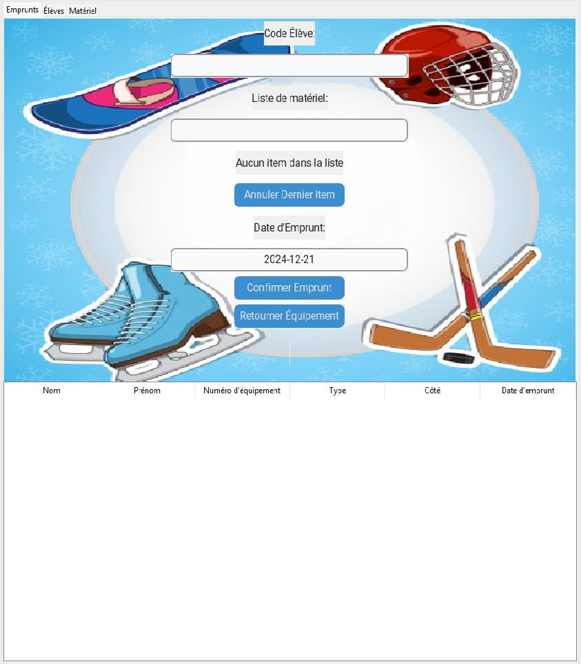

# Gestion de Location d'équipement Sportif

## Description
Cette application gère la location de matériel sportif, les élèves et les emprunts. Elle inclut une interface graphique interactive écrite en Python en utilisant `customtkinter` et `ttk`. Les données sont stockées dans une base de données SQLite.

## Aperçu Visuel

Voici un aperçu de l'application de gestion de location sportive :



### Gestion des Élèves
- Ajouter, modifier et supprimer des élèves.
- Rechercher des élèves par nom, prénom ou code.
- Afficher tous les élèves enregistrés.

### Gestion du Matériel
- Ajouter, modifier et supprimer du matériel sportif.
- Gérer le statut du matériel (disponible/prêté).

### Gestion des Emprunts
- Ajouter de nouveaux emprunts en associant un élève à un ou plusieurs articles.
- Mettre à jour le statut du matériel après emprunt ou retour.
- Afficher une liste des emprunts en cours et des emprunts terminés.
- Retourner un ou plusieurs articles et enregistrer la date de retour.

## Prérequis

1. Python 3.10 ou supérieur.
2. Bibliothèques Python nécessaires (peuvent être installées avec `pip`) :
   - `customtkinter`
   - `pillow` (pour l'image de fond dans GestionEmprunt).

## Installation

1. Clonez le dépôt ou téléchargez les fichiers.
2. Assurez-vous que Python 3.10 ou supérieur est installé sur votre machine.
3. Installez les dépendances en utilisant la commande suivante :
   ```bash
   pip install customtkinter pillow
   ```
4. Placez tous les fichiers dans un répertoire unique.
5. Exécutez `Main.py` pour lancer l'application.

## Utilisation

1. Lancez l'application en exécutant le fichier `Main.py`.
2. Naviguez entre les onglets pour gérer les élèves, le matériel et les emprunts.
3. Ajoutez ou mettez à jour les données via les formulaires fournis.
4. Visualisez les informations mises à jour dans les tableaux interactifs.
5. Je suggère d'utiliser un scanneur à code bare et des étiquettes code barre pour les code d'élèves et des équipements.
6. [Liste du matériel suggéré](https://www.amazon.ca/hz/wishlist/ls/3JMD4SEDUJQE8?ref_=wl_share)
 
## Exemple de Structure de la Base de Données

### Table `eleve`
- `id_eleve` : Identifiant unique.
- `nom` : Nom de l'élève.
- `prenom` : Prénom de l'élève.
- `code` : Code unique associé à l'élève.

### Table `materiel`
- `id_materiel` : Identifiant unique.
- `num_materiel` : Numéro unique du matériel.
- `type` : Type de matériel (ex. ski, casque).
- `grandeur` : Taille ou dimensions.
- `cote` : État ou côté d'usage.
- `date_achat` : Date d'achat.
- `status` : Statut (0 pour prêté, 1 pour disponible).

### Table `emprunts`
- `id_emprunt` : Identifiant unique.
- `id_eleve` : Référence à l'identifiant de l'élève.
- `id_materiel` : Référence à l'identifiant du matériel.
- `date_emprunt` : Date de l'emprunt.
- `date_retour` : Date de retour.

## Développement Futur
- Ajouter des notifications ou rappels pour les emprunts en retard.
- Inclure un système de rapport pour exporter les données.
- Améliorer l'interface utilisateur avec des thèmes personnalisés.

## Licence
Ce projet est sous licence MIT. Vous êtes libre de le modifier et de le redistribuer avec attribution.

